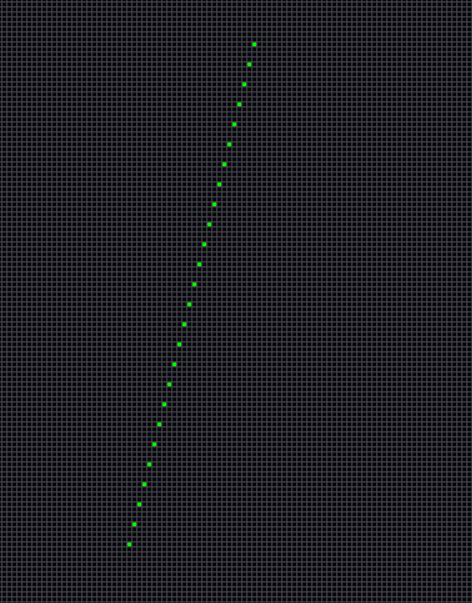
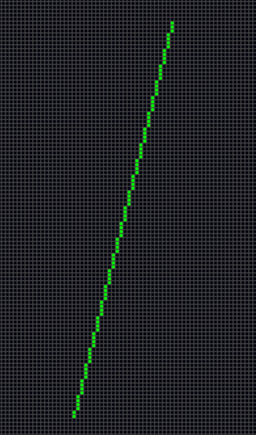
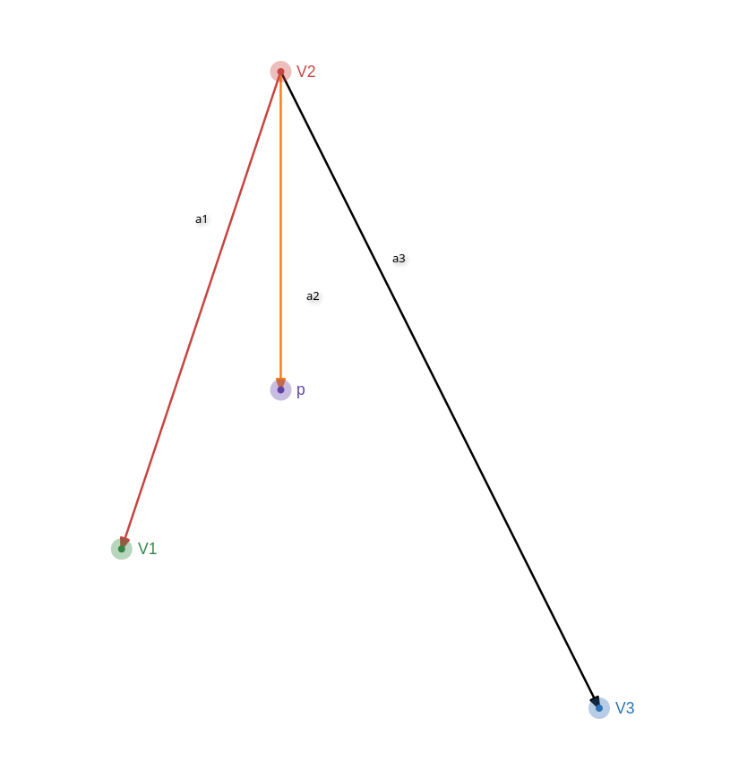
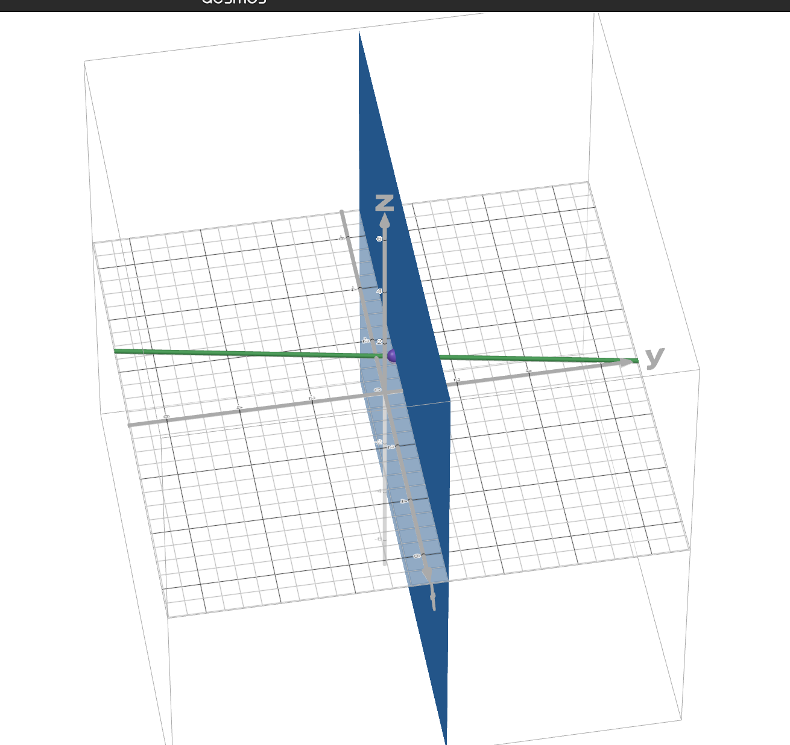
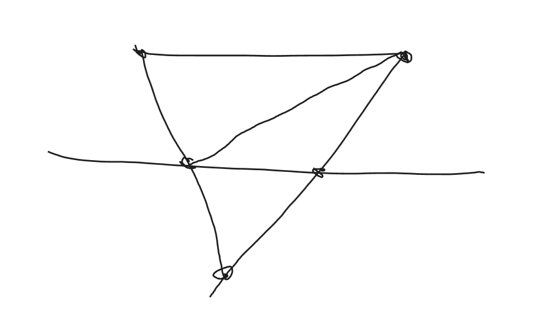
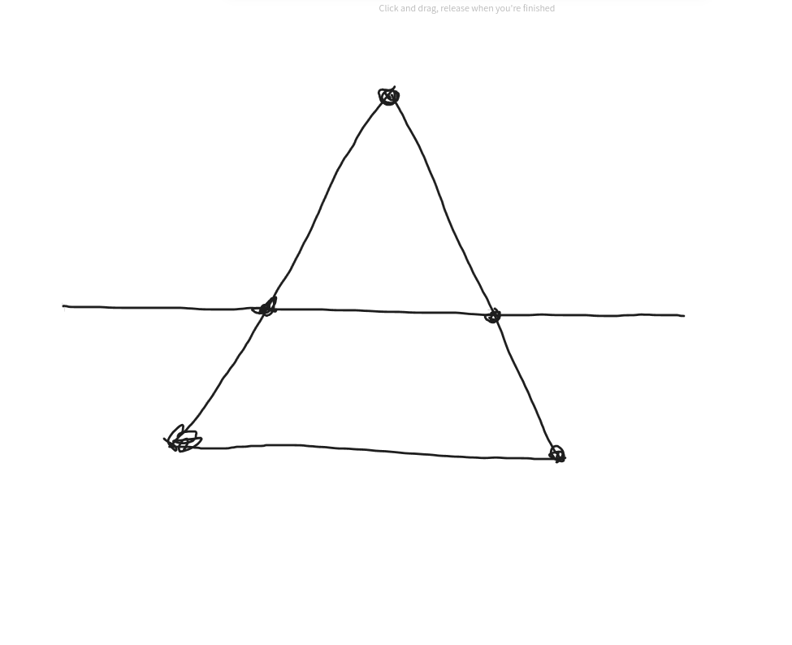

# Proj 1

## Hosted Website

[**LEVEL 1**](https://graphics.csquad.xyz/proj1/level1/level1.html)

[**LEVEL 2**](https://graphics.csquad.xyz/proj1/level2/level2.html)

[**LEVEL 3**](https://graphics.csquad.xyz/proj1/level3/level3.html)

## Object representation

In level 1 and 2 all objects were represented as objects with four properties, `vertices`, `edges`, `color`, and `scale`. Vertices will define a 3d point in space and then edges will represent the lines between them. Color represents what the color of the line should be and the scale is what the x, y, and z dimesion of the vertice should be multiplied by before the offset is added to the point. 

```js
const laneLine = {
"vertices": [
    {"x": 0, "y": 0, "z": 0},
    {"x": 0, "y": 0, "z": 1},
],
"edges": [
    [0,1],
],
"color": "white",
"scale": {x: 1, y: 1, z: 1}
}
```

In level 3 all objects are defined as objects with three properties, `triangles`, `color` and `scale`. Triangles is an array of arrays of vertices where each element is another array that contains three three dimensional points representing a point of the triangle. Color is the color that the triangle should be colored. Scale is what the x, y, and z dimesion of the vertice should be multiplied by before the offset is added to the vertex. 


## Pin hole projection

This project used pinhole projection for all three levels to know where to place the points on the screen. For the line projection it looked that the ends of the line and used a general formula that looked like this:

```
p1.u = (cam1.x/cam1.z) * cols + cols / 2
p1.v = (cam1.y/cam1.z) * rows + rows / 2
```

`cam1.x/cam1.z` calculates the ratio it should be across the screen then scales it with the amount of cols or rows the display has. 


## Line Drawing

For level 2 the function that was responsible for drawing the lines on the pixel screen was the function below:

```js
function drawLine(u1, v1, u2, v2, color) {
    let x1 = u1, y1 = v1;
    let x2 = u2, y2 = v2;

    const steep = Math.abs(y2 - y1) > Math.abs(x2 - x1);
    if (steep) {
        [x1, y1] = [y1, x1];
        [x2, y2] = [y2, x2];
    }

    if (x1 > x2) {
        [x1, x2] = [x2, x1];
        [y1, y2] = [y2, y1];
    }

    const m = (x2 === x1) ? 0 : (y2 - y1) / (x2 - x1);
    const b = y1 - m * x1;

    for (let x = x1; x <= x2; x++) {
        const y = Math.round(m * x + b);
        if (steep) setPixelColor(y, x, color);  
        else       setPixelColor(x, y, color);
    }
}
```

First thing this function does is see if the coordinates it received are "steep" this means that the change is y is faster than the change in x. If it is it will swap the x and y coordinates so that it iterates over the dimension that "changes slower". Without this steep lines would iterate over the dimension that has "less change" and the line in turn would have less pixel resulting in gaps. 

Line rendering without the steep check:



Line rendering with the steep check:




It will also make sure that x1 is smaller than x2 so that the for loop isn't messed up. It will then loop through the x coordinates and place a pixel where it has too. 

## Triangle Drawing

For level 3 this function was responsible for traingle drawing:

```js
  function fillTriangle(v1, v2, v3, color) {
    let maxX = Math.min(cols - 1, Math.ceil(Math.max(v1.x, v2.x, v3.x)))
    let minX = Math.max(0, Math.floor(Math.min(v1.x, v2.x, v3.x)))

    let maxY = Math.min(rows - 1, Math.ceil(Math.max(v1.y, v2.y, v3.y)))
    let minY = Math.max(0, Math.floor(Math.min(v1.y, v2.y, v3.y)))

    for(let x = minX; x <= maxX; x++) {
      for(let y = minY; y <= maxY; y++) {
        let a1 = subtract2dVector(v1, v2)
        let a2 = subtract2dVector({x: x, y: y}, v2)
        let a3 = subtract2dVector(v3, v2)

        let x1 = a1.x
        let y1 = a1.y

        let x2 = a2.x
        let y2 = a2.y

        let x3 = a3.x
        let y3 = a3.y

        let l3 = (x1*y2 - x2*y1) / (x1*y3 - x3*y1)
        let l1 = (x2*y3 - x3*y2) / (x1*y3 - x3*y1)
        let l2 = 1 - (l1+l3)

        if (betweenInts(l1, 0 , 1) && betweenInts(l2, 0, 1) && betweenInts(l3, 0, 1)){
          setPixelColor(x, y, color)
        }
      }
    }
  }
```

The way this calculates the barycentric coordinates (`l1, l2, and l3`) from solving the system of equations. 
```
l1 + l2 + l3       = 1
l1V1 + l2V2 + l3V3 = p
```

Solve the top for l2:
```
1 - l1 - l3       = l2
l1V1 + l2V2 + l3V3 = p
```

Substitute into second equation:
```
l1V1 + (1 - l1 - l3)V2 + l3V3 = p
```

Distribute V2:
```
l1V1 + V2 - l1V2 - l3V2 + l3V3 = p
```

Group like terms:
```
l1V1 -l1V2 + l3V3 - l3V2 + V2 = p
```

Factor out l1 and l3:
```
l1(V1 - V2) + l3(V3 - V2) + V2 = p
```

Subtract V2:
```
l1(V1 - V2) + l3(V3 - V2) = p - V2
```

Give `(V1 - V2)`, `(V1 - V2)` and `(V1 - V2)` names: 
```
l1a1 + l3a3 = a2
```



a1 and a3 are vertices with x and y coordintes which means there is an x equation and a y equation:
```
l1a1.x + l3a3.x = a2.x
l1a1.y + l3a3.y = a2.y
```

This gives up two equations and two unknows which can be solved as a linear combination and gives us this answer from the function:
```js
let l3 = (x1*y2 - x2*y1) / (x1*y3 - x3*y1)
let l1 = (x2*y3 - x3*y2) / (x1*y3 - x3*y1)
```

## Near Plane Problem

How I solved the near plane in levels 1 and 2 was used these 2 function:

```js
function makeLines() {
    let offsetIndex = 0
    for (let obj of scene.objs){
        let offset = scene.offset[offsetIndex]
        for(let e = 0; e < obj.edges.length; e++) {
        let v1 = {x: (obj.vertices[obj.edges[e][0]].x * obj.scale.x) + offset.x, y: (obj.vertices[obj.edges[e][0]].y * obj.scale.y) + offset.y, z: (obj.vertices[obj.edges[e][0]].z * obj.scale.z) + offset.z}
        let v2 = {x: (obj.vertices[obj.edges[e][1]].x * obj.scale.x) + offset.x, y: (obj.vertices[obj.edges[e][1]].y * obj.scale.y) + offset.y, z: (obj.vertices[obj.edges[e][1]].z * obj.scale.z) + offset.z}

        let cam1 = { x: v1.x - camera.x, y: v1.y - camera.y, z: v1.z - camera.z }
        let cam2 = { x: v2.x - camera.x, y: v2.y - camera.y, z: v2.z - camera.z }

        let vert1_in_front = cam1.z > limit
        let vert2_in_front = cam2.z > limit

        // if(!vert1_in_front || !vert2_in_front) continue;

        // Both vertices are behind --> dont render it
        if(!vert1_in_front && !vert2_in_front) continue;

        // If one is in front and the other behind we need to move the one behind in front of the camera in a way that doesn't look goofy
        if(vert1_in_front && !vert2_in_front) {
            cam2 = planeIntersect(cam1, cam2)
        }
        if(!vert1_in_front && vert2_in_front) {
            cam1 = planeIntersect(cam2, cam1)
        }

        let p1 = {}
        p1.u = (cam1.x/cam1.z) * cols + cols / 2
        p1.v = (cam1.y/cam1.z) * rows + rows / 2

        let p2 = {}
        p2.u = (cam2.x/cam2.z) * cols + cols / 2
        p2.v = (cam2.y/cam2.z) * rows + rows / 2

        drawLine(Math.round(p1.u), Math.round(rows - p1.v), Math.round(p2.u), Math.round(rows - p2.v), obj.color)
        }
        offsetIndex+=1
    }
}

function planeIntersect(front, back) {
    let new_back_vert = {}
    // t is a fraction of how much of the line is visable
    let t = (front.z - limit) / (front.z - back.z)

    new_back_vert.x = front.x + t * (back.x - front.x)
    new_back_vert.y = front.y + t * (back.y - front.y)
    new_back_vert.z = limit
    return new_back_vert;
}
```

For a simple line there are three possibilities:

- Both Vertices are in front --> Render it normally

- Both Vertices are behind --> Dont render it

- One vertex is in front and one is behind --> Find the intersection with the near plane and place the behind vertex there



When doing it with triangles the solution is also quite simple expect now there are four possibilities we use the same `planeIntersect()` function:

- All three vertices are in front --> Render it normally

- Two vertices are in front --> Split into two triangles



- One vertex is in front --> Draw only the triangle showing



- All three vertices are behind --> Dont Draw it

How it looks in code:
```js
  // Expects these to be in cam space
  function makeTriangles(v0, v1, v2, color) {

    let vert0_in_front = v0.z >= limit
    let vert1_in_front = v1.z >= limit
    let vert2_in_front = v2.z >= limit

    // if(!vert0_in_front || !vert1_in_front || !vert2_in_front) {
    //   return;
    // }

    if(!vert0_in_front && !vert1_in_front && !vert2_in_front){
      return;
    }
    else if(vert0_in_front && !vert1_in_front && !vert2_in_front) {
      let new_vert1 = planeIntersect(v0, v1)
      let new_vert2 = planeIntersect(v0, v2)
      makeTriangles(v0, new_vert1, new_vert2, color)
      return;
    }
    else if (!vert0_in_front && vert1_in_front && !vert2_in_front) {
      let new_vert1 = planeIntersect(v1, v0)
      let new_vert2 = planeIntersect(v1, v2)
      makeTriangles(v1, new_vert1, new_vert2, color)
      return;
    }
    else if (vert0_in_front && vert1_in_front && !vert2_in_front) {
      let v02_intersect = planeIntersect(v0, v2)
      let v12_intersect = planeIntersect(v1, v2)

      makeTriangles(v0, v1, v02_intersect, color)
      makeTriangles(v1, v02_intersect, v12_intersect, color)
      return;
    }
    else if (!vert0_in_front && !vert1_in_front && vert2_in_front) {
      let new_vert1 = planeIntersect(v2, v0)
      let new_vert2 = planeIntersect(v2, v1)
      makeTriangles(v2, new_vert1, new_vert2, color)
      return;
    }
    else if (vert0_in_front && !vert1_in_front && vert2_in_front) {
      let v12_intersect = planeIntersect(v2, v1)
      let v01_intersect = planeIntersect(v0, v1)

      makeTriangles(v2, v12_intersect, v0, color)
      makeTriangles(v0, v01_intersect, v12_intersect, color)
      return;
    }
    else if (!vert0_in_front && vert1_in_front && vert2_in_front) {
      let v02_intersect = planeIntersect(v2, v0)
      let v01_intersect = planeIntersect(v1, v0)

      makeTriangles(v2, v02_intersect, v1, color)
      makeTriangles(v1, v01_intersect, v02_intersect, color)
      return;
    }

    let p0 = {}
    p0.x = (v0.x/v0.z) * cols + cols / 2
    p0.y = rows / 2 - (v0.y/v0.z) * rows

    let p1 = {}
    p1.x = (v1.x/v1.z) * cols + cols / 2
    p1.y = rows / 2 - (v1.y/v1.z) * rows

    let p2 = {}
    p2.x = (v2.x/v2.z) * cols + cols / 2
    p2.y = rows / 2 - (v2.y/v2.z) * rows
    
    fillTriangle(p0, p1, p2, color)
  }
```
